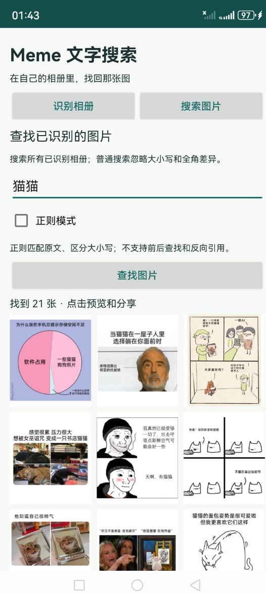
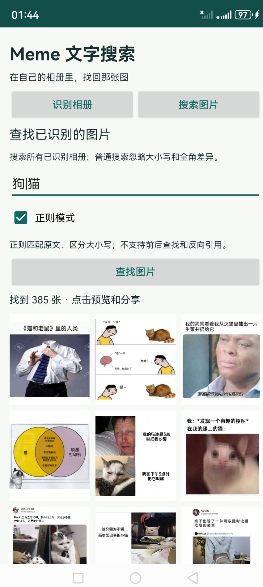

# Where's My Meme

一款纯本地、轻量、无需部署的 Android meme搜索工具。读取本地相册，识别图片中的文字并保存结果，之后输入文字就能查找对应的 meme。

[安装包](https://github.com/rb-tyz/wheres-my-meme/releases/download/v1.0.0/MemeOCR-1.0.0.apk) · [测试记录](docs/verification.md) · [English](README.md)

- **纯本地**：OCR 模型随安装包提供，识别、缓存和搜索都在手机上完成，无需联网，不上传图片。
- **轻量**：使用 Kotlin 和 Android 原生界面，按批次处理图片，复用已保存的识别结果，并限制图片解码和缩略图缓存的内存占用。
- **无需部署**：安装 APK、授予照片读取权限即可使用，不需要搭建服务器或配置云服务。

## 项目背景

**谁会不喜欢meme呢？**

作为一个收藏了9000张（目前）meme的老吃家，我总是在聊天的时候偶然想到一张非常符合氛围、可以直接杀死比赛的meme，但是苦于没有好的检索手段，总是只能作罢。
此时Astra大人神兵天降，帮 ~~（替）~~ 我写 ~~（vibe）~~ 出了这款工具。

## 当前版本

1.0.0，已签名的非调试版 APK，约 44.2 MiB。支持 Android 8.0 / API 26 及以上版本。

已在没有 Google Play 服务、关闭网络的 Android 11 AOSP 模拟器及华为Mate60Pro手机中运行验证。

## 安装与使用

1. 将 [MemeOCR-1.0.0.apk](https://github.com/rb-tyz/wheres-my-meme/releases/download/v1.0.0/MemeOCR-1.0.0.apk) 传到手机，使用系统安装器打开。如果系统询问，允许用于打开文件的应用安装此 APK。
2. 打开 **Meme 文字搜索**，授予照片读取权限。应用只显示获准访问的图片。通知权限用于在通知栏展示识别进度。
3. 选择本地相册。第一次建议先处理 100 张，看看自己图库里的识别效果。默认每批 1000 张，可输入 1–10000。
4. 点击 **开始识别本批**。每张识别完成后先保存，再更新进度。点击 **停止本批** 后，会处理并保存当前图片，然后停止。
5. 再次开始时自动跳过已完成且未改变的图片；没有文字也算完成。失败的图片通过 **重试本相册失败项** 单独重试。
6. 切换到 **搜索图片**，输入文字并点击 **查找图片**。点击结果可预览原图，再打开系统分享菜单。

搜索范围为所有已经识别、当前仍获准访问的相册。图片删除、内容发生可检测的变化或访问权限丢失后，旧记录不会继续出现在搜索结果里。

<table align="center">
  <tr>
    <th align="center">文字搜索：猫猫</th>
    <th align="center">正则搜索：狗|猫</th>
  </tr>
  <tr>
    <td align="center" width="50%"></td>
    <td align="center" width="50%"></td>
  </tr>
</table>

## 文字与正则搜索

普通搜索按文字包含关系匹配，忽略英文字母大小写、全角 ASCII 差异，并合并连续空白。搜索不会纠正 OCR 错字，也不能按画面含义查找无文字图片。

勾选 **正则模式** 后，对识别原文匹配，区分大小写。例如：

| 表达式 | 匹配内容 |
| --- | --- |
| 摸鱼\|放假 | 包含任意一个词 |
| [0-9]{4} | 连续四位数字 |
| (?s)晚安.*明天 | 先出现“晚安”，后出现“明天”，中间可以换行 |

正则使用 RE2/J，避免复杂表达式反复回溯导致长时间卡住。不支持前后查找和反向引用；不支持的语法会显示错误提示。

## 图片、缓存与隐私

- 原图只读，不改名、不移动、不写入，也不上传。
- 发布 APK 没有联网权限、外部存储写入权限或“管理所有文件”权限。中文模型已打包，不需要首次使用时联网下载。
- 识别文字、图片元数据和失败原因保存在应用私有 SQLite 数据库中，关闭了应用数据自动备份。卸载或清除应用数据会删除识别缓存。
- 用媒体 URI、文件大小和修改时间判断是否为已处理版本。检测到版本变化会重新识别；移动或复制图片后可能再次处理。首版不做内容哈希去重。
- 动图只识别首帧，预览也是静态图；分享时发送原文件。
- 模糊字、小字和艺术字可能误识别。测试样本中出现过“今天也要开心”被识别为“今天也妻开心”，因此不能保证长句逐字匹配。可以尝试较短的词语，但未识别出的字仍无法检索。
- 前台服务显示进度，但系统仍可能结束任务。已保存结果保留，重新打开后开始下一批即可；不承诺强制结束或重启手机后自动继续。
- 尚未测量 9000 张真实 meme 的全量识别耗时与准确率。自动测试中的 9000 条数据用于检验批次和搜索行为，不代表手机 OCR 的速度。

## 从源码构建

需要 JDK 17、Android SDK platform 35、build-tools 34.0.0。第一次下载依赖需要网络。项目固定使用 Gradle 8.9、AGP 8.7.3、Kotlin 2.0.21，Gradle wrapper 包含下载校验值。

    export JAVA_HOME=/path/to/jdk17
    export ANDROID_HOME=/path/to/android-sdk
    ./scripts/build-apk.sh

脚本运行单元测试和发布版 lint，构建并签名 APK，检查签名和权限，最后生成 artifacts/SHA256SUMS。

首次运行会在 .signing/ 生成签名密钥。以后发布更新需要保留同一密钥，请妥善备份该目录，不要随 APK 分发，也不要提交到版本库。丢失密钥后，新签名的 APK 无法覆盖安装旧版本。

可通过 GRADLE_BIN 指定已有 Gradle，通过 GRADLE_USER_HOME 指定隔离缓存，无须更改全局 Java 或系统配置。

## 测试与目录

    ./gradlew :core:test :app:lintDebug :app:assembleDebug
    ./gradlew :app:connectedDebugAndroidTest

设备测试应使用模拟器或专用测试设备，输入为自制图片和临时数据库记录。中文 OCR 集成测试验证离线模型可调用、可识别指定词语，不要求每个字符完全正确；已知误差保存在测试记录中。

- core/：批次选择、逐张处理循环、状态、文字标准化与搜索。
- app/：Android 原生界面、只读相册访问、有界图片解码、SQLite 和前台识别服务。
- app/src/androidTest/：在 Android 上运行的解码、数据库和 OCR 测试。
- scripts/build-apk.sh：构建、签名与安装包检查。
- docs/verification.md：实际结果、截图、识别误差和真机待验项目。

实现资料：[ML Kit 中文识别](https://developers.google.com/ml-kit/vision/text-recognition/v2/android)、[Android MediaStore](https://developer.android.com/training/data-storage/shared/media)、[RE2/J](https://github.com/google/re2j)。

## 许可证

本项目代码采用 [MIT 许可证](LICENSE)。第三方依赖和截图中的表情包仍受各自的许可证及版权约束。
