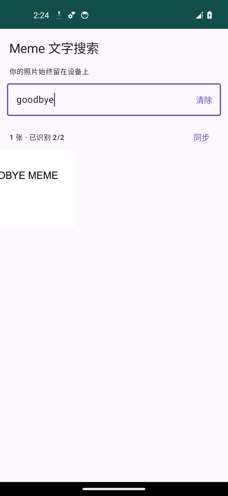
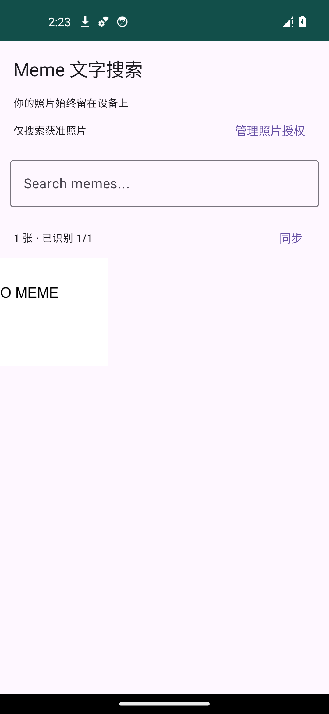
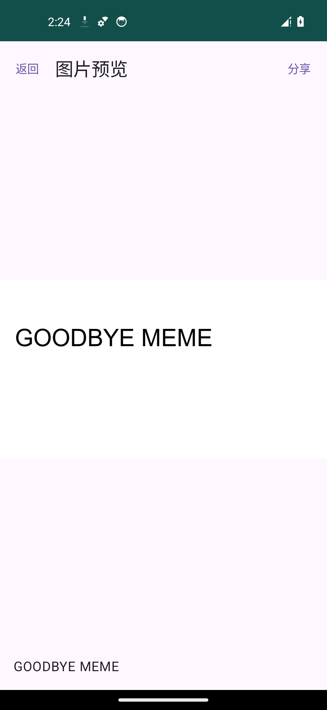

# Meme 文字搜索 · MemeSearch

基于 [rb-tyz/wheres-my-meme](https://github.com/rb-tyz/wheres-my-meme) 的 MIT 开源改进版。感谢原作者提供基础实现；保留原版权声明与许可证。

这是一个分享给朋友使用的小工具，目前作为 MVP / 预览版提供。Android 1.1.0 曾由用户在 Redmi Note 14 Pro+ 上试用并反馈未发现问题；1.2.0 的自动化验证使用 Android 14 模拟器，尚未在该手机上复测。其他机型与系统版本仍待验证。

[下载 APK / Releases](https://github.com/Water5tar/meme-text-search/releases) · [1.2.0 测试报告](TEST-REPORT-v1.2.0.md) · [与上游的区别](FORK.md) · [版本记录](CHANGELOG.md)

**Your photos never leave your device.**

读取系统相册，在设备上识别图片里的中英文，再按文字搜索表情包。无需联网、账号、服务器或 API Key。

## 与原项目的区别

- 授权后自动索引获准照片，暂停、继续和重新打开后续处理。
- Compose 图片网格，输入后 200 ms 防抖搜索，Room 查询和分页。
- WorkManager 持久队列，新增 / 修改 / 删除的增量同步。
- 内置中文及拉丁文字模型，处理 Android 14 的部分照片授权。

原版的相册选择、正则搜索和通知栏进度没有保留。基本目标仍是离线按图片里的文字查找表情包，没有语义搜索。

## 界面

以下是 Android 1.1.0 签名 release APK 的模拟器截图，使用合成测试图片：

<p>
  
  
  
</p>

## 安装与使用

1. 从本仓库 [Releases](https://github.com/Water5tar/meme-text-search/releases) 下载最新的 `MemeSearch-*.apk`，复制到手机并允许文件管理器安装此 APK。最低 Android 8.0（API 26）。GitHub 页面自动提供的 Source code ZIP 是源码，不能直接安装。
2. 打开“Meme 文字搜索”，授权读取照片。Android 14 及以后可以选择全部照片或部分照片。
3. 授权后自动索引。首页显示已识别数量、总数量和后台任务状态；已识别的图片可以立即搜索。
4. 在 `Search memes...` 输入图片中的文字，例如“笑死”。英文不区分大小写；全角 ASCII、中文字符间空白、换行会规范化。
5. 点图片查看预览，返回后继续停留在刚才的网格位置；点“分享”调用系统分享面板。
6. 可以暂停、继续或重试失败图片。重新打开 App 时会同步新增、修改和删除的图片，已完成且未变化的图片通常不会再次 OCR。升级到 1.2.0 时，为建立竖排搜索索引，会对已识别图片重新 OCR 一次；期间旧搜索文字仍可使用。

## iPhone 版状态

[iPhone 版源码与构建说明](ios/README.md)已经提供：原生 SwiftUI + PhotoKit + 系统 Vision + 本机 SQLite。它仍是源码预览，没有可供朋友直接安装的 IPA 或 TestFlight 版本，也尚未在 iPhone 真机上验证。仓库的 macOS 自动化构建检查模拟器编译与排版逻辑；获得签名与分发条件后还需完成真机测试。

空搜索词显示获准访问的相册图片；输入文字后只匹配成功识别的 OCR 文字。搜索使用字面包含关系：`%`、`_`、标点都当作普通字符，不匹配文件名、分类或含义相近的词。OCR 本身可能误识别、漏字；这会影响搜索命中。

Android 14 的“管理照片授权”可重新选择照片。拒绝或撤销权限后显示授权界面；系统不再允许读取的图片不会继续展示。部分授权时，不可访问的索引会隐藏并保留，重新授权后可复用。全部授权的同步确认图片删除后才删除对应索引。临时移除 SD 卡时保留其索引，待重新插入后同步。

后台任务由 WorkManager 调度，分段完成，每段最多 80 张或约 3 分钟，OCR 并发数为 1。切到后台会尽量继续；省电策略、系统调度或手动强行停止可能延后任务，下次打开可从未完成的图片继续。暂停会等待当前一张图片收尾，防止在 ML Kit 使用图片时释放 Bitmap。

## 隐私与存储

- 使用内置 ML Kit 中文、拉丁文字模型，首次识别也不下载模型。
- 最终 Manifest 明确移除 `INTERNET` 和 `ACCESS_NETWORK_STATE`。没有登录、分析后台或远程搜索。
- 原图保持原来的 MediaStore `content://` URI，只读访问；不复制到 App 私有目录，不修改原图。
- Room 仅保存 URI、元数据、OCR 原文、规范化文本、时间和处理状态。缩略图仅做内存缓存。
- 分享时将原图 URI 和临时读取权限交给用户选择的目标 App。目标 App 如何处理分享内容由该 App 决定。
- 禁止系统备份和设备迁移。卸载本 App 会清除其索引，不会删除系统相册图片。

## 实现

Kotlin / Jetpack Compose / MediaStore / bundled ML Kit / Room / Coroutines / WorkManager / Coil / Paging。

Room `photos` 以内容 URI 为主键，`volumeName + mediaStoreId` 唯一，避免多存储卷 ID 冲突。`indexed` 包括“成功识别但没有文字”的图片；`pending` 等待处理；`failed` 等待用户重试或图片版本变化。每张图片的结果立即写入数据库。

Android 11+ 使用 MediaStore generation 查询新增或变化的元数据；Android 8–10 使用带重叠窗口的新增/修改时间查询。每次同步还做一遍 ID 查询，以检测删除和较老图片的新授权，不重新解码全部图片。首次或 MediaStore 数据库重建、授权范围变化时重新读取元数据。相册在扫描中发生变化时，不提交删除检查点，稍后重试。

OCR 解码最长边不超过 2,560 像素，处理 EXIF 方向，一张一张释放 Bitmap；极长图片按最长边缩放，文字太小可能降低识别率。缩略图请求 360 像素，预览请求 2,048 像素。搜索防抖 200 毫秒，数据库查询在后台执行；分页每页 60 条，界面使用 3 列（宽屏 4 列）LazyVerticalGrid。

没有语义搜索、LLM、embedding、云 OCR、相册修改或复杂实时监听。当前库查询采用 SQLite `instr` 字面 substring；未引入 FTS。

## 编译与测试

需要 JDK 17、Android SDK 35；仓库内包含 Gradle 8.9 wrapper。构建依赖的首次下载需要联网，安装后的 App 不需要联网。

Windows PowerShell 示例（环境路径替换成你的安装位置）：

```powershell
$env:JAVA_HOME = 'D:\Tools\jdk-17'
$env:ANDROID_HOME = 'D:\Tools\android-sdk'
Set-Content local.properties "sdk.dir=$($env:ANDROID_HOME.Replace('\','/'))"
.\gradlew.bat :core:test :app:assembleDebug :app:lintDebug
.\gradlew.bat :app:connectedDebugAndroidTest
```

Android 设备测试使用 API 34、照片授权。真实合成图片压力测试默认为 1,000 张，也可单独指定规模：

```powershell
.\gradlew.bat :app:connectedDebugAndroidTest '-Pandroid.testInstrumentationRunnerArguments.class=com.memeocr.app.ThousandPhotoTest' '-Pandroid.testInstrumentationRunnerArguments.photoScale=5000'
.\gradlew.bat :app:connectedDebugAndroidTest '-Pandroid.testInstrumentationRunnerArguments.class=com.memeocr.app.ThousandPhotoTest' '-Pandroid.testInstrumentationRunnerArguments.photoScale=10000'
```

设备测试会在相册创建测试图片，测试结束会删除自己创建的图片。请使用测试设备或模拟器。

发布构建可在项目根目录放置未跟踪的 `signing.properties`：

```properties
storeFile=D:/private/meme-local.jks
storePassword=你的密码
keyAlias=meme-local
keyPassword=你的密码
```

随后执行 `.\gradlew.bat :app:assembleRelease :app:lintRelease`。没有签名配置时生成未签名 release APK。不要将私钥或密码提交到 Git。

预编译 APK 使用本地发布签名。维护者需私下保存原签名密钥，用同一密钥签名才能覆盖安装更新。仓库不包含私钥、密码或本机配置；普通用户直接安装 Release APK，无需自行配置签名。

Linux / macOS 在设置 JDK 和 SDK 后可运行 `bash scripts/build-apk.sh`；发布构建需要事先准备私下保存的 `signing.properties`，脚本不会创建或替换发布密钥。Windows 可使用 `scripts/build-local.ps1 -Release`。

## 来源与验证

基于 MIT 项目 [rb-tyz/wheres-my-meme](https://github.com/rb-tyz/wheres-my-meme)，固定提交 `168a6630d65f4a5a0d9fc03a7bab7d4aef85b6b5`；保留 MIT License，改动说明见 FORK.md。新包名 `com.memeocr.local`，可与上游版本共存，索引不从上游版本迁移。

本次结果和验证边界见 [1.2.0 测试报告](TEST-REPORT-v1.2.0.md)。模拟器结果不代表真实手机或不同照片内容的耗时。Android 8–13 与 Android 15+ 的真机、不同厂商的后台省电策略仍需在目标手机验证。

## 反馈与参与

欢迎朋友们试用。遇到问题请在 [Issues](https://github.com/Water5tar/meme-text-search/issues) 说明 Android 版本、照片授权方式和复现步骤；也可以提交修复。详情见 [CONTRIBUTING.md](CONTRIBUTING.md)。

上游历史资料归档在 `docs/upstream/`，其中的旧截图、性能数字和真机记录不代表本版验证结果。
